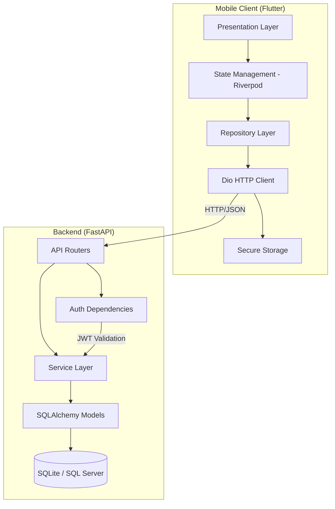
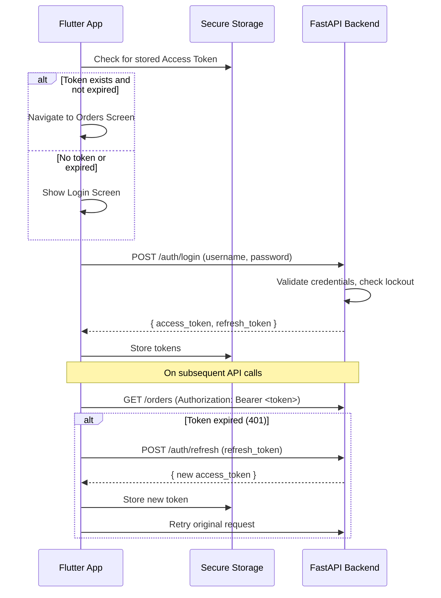
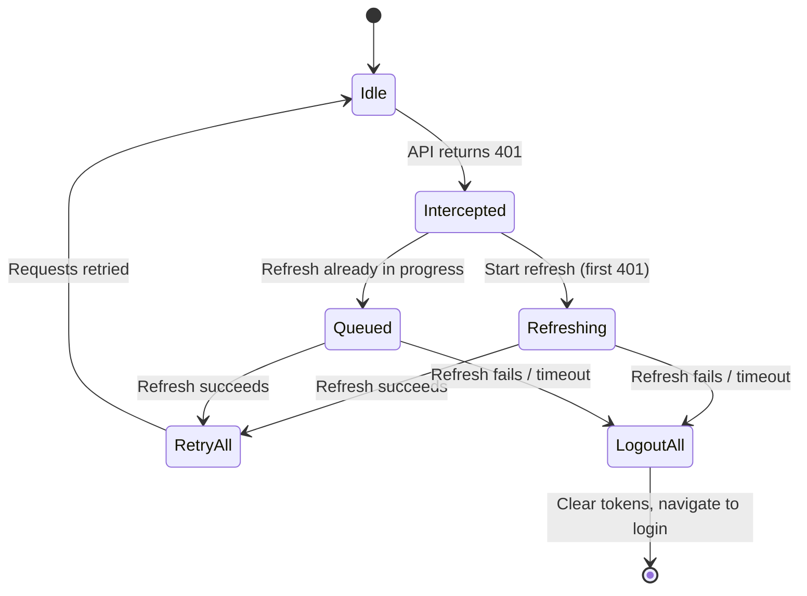
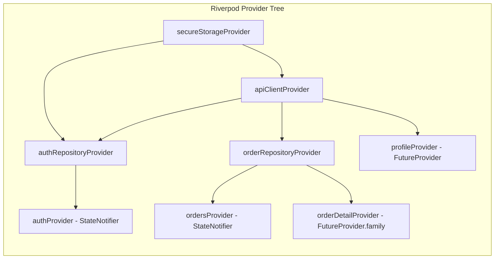

# Design Document: Order Tracker

## Overview

Order Tracker is a B2B mobile application with a Flutter frontend and FastAPI backend that enables business customers to securely log in and view their party-isolated orders. The system uses JWT-based authentication with automatic token refresh, party_code-based data isolation, and a clean layered architecture on both client and server.

The application follows a request-response pattern where the Flutter app communicates with the FastAPI backend over HTTPS using JSON. Authentication state is persisted on-device using platform-specific secure storage, and the backend enforces data isolation by extracting party_code exclusively from JWT claims.

## Architecture

### High-Level System Diagram



### Authentication Flow



### Token Refresh and Request Queuing



## Components and Interfaces

### Backend Components

#### Core Layer (`app/core/`)

| Component | Responsibility |
|-----------|---------------|
| `config.py` | Pydantic Settings loading from `.env`. Exposes `get_settings()` singleton. |
| `database.py` | Async SQLAlchemy engine, session factory, `Base` declarative class, `init_db()`, `get_db()` dependency. |
| `security.py` | Password hashing (bcrypt cost 12), JWT creation/verification (python-jose HS256). |
| `dependencies.py` | `get_current_user` FastAPI dependency: extracts Bearer token, validates JWT type="access", queries user, checks `is_active`. |

#### Service Layer (`app/services/`)

| Service | Interface |
|---------|-----------|
| `auth_service.py` | `authenticate_user(db, username, password) -> CustomerUser \| None`<br>`create_tokens(user) -> TokenResponse`<br>`refresh_access_token(token) -> RefreshResponse`<br>`check_lockout(db, username) -> bool`<br>`record_failed_attempt(db, username) -> None`<br>`clear_failed_attempts(db, username) -> None` |
| `order_service.py` | `get_orders(db, party_code, search, sort_by, sort_order) -> OrderListResponse`<br>`get_order_by_id(db, order_id, party_code) -> Order` |

#### Router Layer (`app/routers/`)

| Router | Endpoints |
|--------|-----------|
| `auth.py` | `POST /auth/login` — credentials validation, token issuance, lockout check<br>`POST /auth/refresh` — validate refresh token, issue new access token<br>`POST /auth/logout` — stateless acknowledgment |
| `orders.py` | `GET /orders` — party-filtered list with search/sort<br>`GET /orders/{order_id}` — single order with party isolation check |
| `profile.py` | `GET /profile` — authenticated user's profile data |

### Flutter Components

#### Core Layer (`lib/core/`)

| Component | Responsibility |
|-----------|---------------|
| `api_client.dart` | Dio wrapper with base URL, timeouts (30s), interceptor registration. Exposes `get()` and `post()` methods. |
| `auth_interceptor.dart` | Attaches Bearer token to requests. On 401: queues concurrent requests, attempts refresh within 10s, retries or triggers logout. |
| `error_interceptor.dart` | Maps DioException types to typed AppExceptions (Network, Unauthorized, NotFound, Server). |
| `secure_storage.dart` | Wrapper around `flutter_secure_storage`. Methods: save/get/clear for access token, refresh token, user info. |
| `app_router.dart` | GoRouter configuration with redirect logic based on auth state. Routes: `/login`, `/orders`, `/orders/:id`, `/profile`. |

#### Feature: Auth (`lib/features/auth/`)

```dart
// State
enum AuthStatus { initial, authenticated, unauthenticated, loading }

class AuthState {
  final AuthStatus status;
  final String? errorMessage;
}

// Provider
class AuthNotifier extends StateNotifier<AuthState> {
  Future<void> checkAuthStatus();  // Check stored tokens on app start
  Future<void> login(String username, String password);
  Future<void> logout();
}

final authProvider = StateNotifierProvider<AuthNotifier, AuthState>(...);
```

#### Feature: Orders (`lib/features/orders/`)

```dart
// State
class OrdersState {
  final AsyncValue<List<OrderModel>> orders;
  final String searchQuery;
}

// Provider
class OrdersNotifier extends StateNotifier<OrdersState> {
  Future<void> fetchOrders();
  void filterBySearch(String query);  // Client-side, 400ms debounce
  Future<void> refresh();
}

final ordersProvider = StateNotifierProvider<OrdersNotifier, OrdersState>(...);
final orderDetailProvider = FutureProvider.family<OrderModel, int>(...);
```

#### Feature: Profile (`lib/features/profile/`)

```dart
final profileProvider = FutureProvider<ProfileModel>(...);
```

### Dispatch Status Mapping Logic

```dart
class DispatchStatusMapper {
  static DisplayStatus mapStatus(String? rawStatus) {
    if (rawStatus == null || rawStatus.trim().isEmpty) {
      return DisplayStatus.unavailable;
    }
    switch (rawStatus.toLowerCase()) {
      case 'pending':
      case 'processing':
      case 'awaiting dispatch':
        return DisplayStatus.notDispatched;
      case 'dispatched':
        return DisplayStatus.dispatched;
      case 'delivered':
        return DisplayStatus.delivered;
      case 'cancelled':
        return DisplayStatus.cancelled;
      default:
        return DisplayStatus.unavailable;
    }
  }
}
```

## Data Models

### Backend Models (SQLAlchemy)

```python
class CustomerUser(Base):
    __tablename__ = "customer_users"
    
    id: Mapped[int] = mapped_column(primary_key=True, autoincrement=True)
    username: Mapped[str] = mapped_column(String(100), unique=True, nullable=False)
    password_hash: Mapped[str] = mapped_column(String(255), nullable=False)
    party_code: Mapped[str] = mapped_column(String(50), nullable=False)
    full_name: Mapped[str] = mapped_column(String(150), nullable=False)
    email: Mapped[Optional[str]] = mapped_column(String(200), nullable=True)
    is_active: Mapped[bool] = mapped_column(default=True)
    created_at: Mapped[datetime] = mapped_column(default=func.now())

class Order(Base):
    __tablename__ = "orders"
    
    id: Mapped[int] = mapped_column(primary_key=True, autoincrement=True)
    party_code: Mapped[str] = mapped_column(String(50), nullable=False)
    order_no: Mapped[str] = mapped_column(String(50), unique=True, nullable=False)
    order_date: Mapped[date] = mapped_column(nullable=False)
    dispatch_status: Mapped[str] = mapped_column(String(50), nullable=False)
    dispatch_date: Mapped[Optional[date]] = mapped_column(nullable=True)
    invoice_no: Mapped[Optional[str]] = mapped_column(String(50), nullable=True)
    tracking_no: Mapped[Optional[str]] = mapped_column(String(100), nullable=True)
    remarks: Mapped[Optional[str]] = mapped_column(Text, nullable=True)
    created_at: Mapped[datetime] = mapped_column(default=func.now())
```

### Backend Schemas (Pydantic v2)

```python
class LoginRequest(BaseModel):
    username: str
    password: str

class TokenResponse(BaseModel):
    access_token: str
    refresh_token: str
    token_type: str = "bearer"
    expires_in: int = 3600

class RefreshResponse(BaseModel):
    access_token: str
    token_type: str = "bearer"
    expires_in: int = 3600

class OrderResponse(BaseModel):
    model_config = ConfigDict(from_attributes=True)
    
    id: int
    order_no: str
    order_date: str
    dispatch_status: str
    dispatch_date: str | None
    invoice_no: str | None
    tracking_no: str | None
    remarks: str | None

class OrderListResponse(BaseModel):
    orders: list[OrderResponse]
    total: int

class ProfileResponse(BaseModel):
    id: int
    username: str
    full_name: str
    email: str | None
    party_code: str
```

### Flutter Models

```dart
class TokenResponse {
  final String accessToken;
  final String refreshToken;
  final String tokenType;
  final int expiresIn;

  TokenResponse({
    required this.accessToken,
    required this.refreshToken,
    required this.tokenType,
    required this.expiresIn,
  });

  factory TokenResponse.fromJson(Map<String, dynamic> json) => TokenResponse(
    accessToken: json['access_token'] as String,
    refreshToken: json['refresh_token'] as String,
    tokenType: json['token_type'] as String,
    expiresIn: json['expires_in'] as int,
  );
}

class OrderModel {
  final int id;
  final String orderNo;
  final String orderDate;
  final String dispatchStatus;
  final String? dispatchDate;
  final String? invoiceNo;
  final String? trackingNo;
  final String? remarks;

  OrderModel({...});

  factory OrderModel.fromJson(Map<String, dynamic> json) => OrderModel(
    id: json['id'] as int,
    orderNo: json['order_no'] as String,
    orderDate: json['order_date'] as String,
    dispatchStatus: json['dispatch_status'] as String,
    dispatchDate: json['dispatch_date'] as String?,
    invoiceNo: json['invoice_no'] as String?,
    trackingNo: json['tracking_no'] as String?,
    remarks: json['remarks'] as String?,
  );

  Map<String, dynamic> toJson() => {
    'id': id,
    'order_no': orderNo,
    'order_date': orderDate,
    'dispatch_status': dispatchStatus,
    'dispatch_date': dispatchDate,
    'invoice_no': invoiceNo,
    'tracking_no': trackingNo,
    'remarks': remarks,
  };
}

class ProfileModel {
  final int id;
  final String username;
  final String fullName;
  final String? email;
  final String partyCode;

  ProfileModel({...});

  factory ProfileModel.fromJson(Map<String, dynamic> json) => ProfileModel(
    id: json['id'] as int,
    username: json['username'] as String,
    fullName: json['full_name'] as String,
    email: json['email'] as String?,
    partyCode: json['party_code'] as String,
  );
}
```

### JWT Payload Structure

```json
{
  "sub": "testuser1",
  "party_code": "PARTY001",
  "type": "access",
  "exp": 1700000000,
  "iat": 1699996400
}
```

### State Management Pattern



### Error Response Format

All backend errors follow a consistent shape:

```json
{ "detail": "Human-readable message (max 150 chars, no technical jargon)" }
```

Flutter maps these to typed exceptions:

| HTTP Status | Exception Type | User-Facing Behavior |
|-------------|---------------|---------------------|
| 401 | `UnauthorizedException` | Trigger token refresh or redirect to login |
| 403 | `ForbiddenException` | Display "Access denied" |
| 404 | `NotFoundException` | Display "Order not found" |
| 422 | `ValidationException` | Display field-level errors |
| 5xx | `ServerException` | Display detail message in SnackBar |
| Timeout | `NetworkException` | Display "Unable to connect..." |


## Correctness Properties

*A property is a characteristic or behavior that should hold true across all valid executions of a system — essentially, a formal statement about what the system should do. Properties serve as the bridge between human-readable specifications and machine-verifiable correctness guarantees.*

### Property 1: JWT claims integrity

*For any* authenticated user, decoding their issued Access_Token and Refresh_Token SHALL yield claims containing the user's exact username as `sub` and their exact `party_code`, matching the database record.

**Validates: Requirements 1.4**

### Property 2: Account lockout enforcement

*For any* username, after 5 consecutive failed login attempts, all subsequent login attempts for that username within a 15-minute window SHALL be rejected regardless of whether the submitted credentials are correct.

**Validates: Requirements 1.9**

### Property 3: Refresh token type validation

*For any* JWT presented to the refresh endpoint that is expired, malformed, or does not have `type` equal to `"refresh"`, the Backend SHALL return a 401 response and SHALL NOT issue a new Access_Token.

**Validates: Requirements 2.4, 2.6**

### Property 4: Party-isolated order access

*For any* authenticated user with party_code P, the Backend SHALL return only orders where `order.party_code == P` for list queries, and SHALL return 403 for individual order requests where `order.party_code != P`, with the 403 response body neither confirming nor denying the order's existence.

**Validates: Requirements 4.1, 7.9, 10.1, 10.2, 10.3, 10.4, 10.6**

### Property 5: Order sorting correctness

*For any* valid combination of `sort_by` (order_date or dispatch_date) and `sort_order` (asc or desc), the Backend SHALL return orders sorted by the specified field in the specified direction. When multiple orders share the same sort field value, they SHALL be secondarily sorted by order id in descending order to ensure deterministic results.

**Validates: Requirements 4.2, 6.1, 6.2, 6.5**

### Property 6: Client-side order search filtering

*For any* search string S and list of orders, the filtered result SHALL contain exactly those orders whose `order_no` contains S as a case-insensitive substring, preserving the relative order of matching items.

**Validates: Requirements 5.1, 5.3**

### Property 7: Dispatch status mapping

*For any* `dispatch_status` string, the mapping function SHALL:
- Return "Not Dispatched" (amber) for case-insensitive matches of "Pending", "Processing", or "Awaiting Dispatch"
- Return "Dispatched" (blue) for case-insensitive match of "Dispatched"
- Return "Delivered" (green) for case-insensitive match of "Delivered"
- Return "Cancelled" (red) for case-insensitive match of "Cancelled"
- Return "Status Unavailable" (grey) for null, empty, or any unrecognized value

**Validates: Requirements 8.1, 8.2, 8.3, 8.4, 8.5, 8.6, 8.7**

### Property 8: Date formatting correctness

*For any* valid ISO date string (yyyy-MM-dd), the `formatDate` function SHALL produce a string in "dd MMM yyyy" format (e.g., "15 Oct 2024"), and `formatDateLong` SHALL produce "dd MMMM yyyy" format (e.g., "15 October 2024"). For null or empty input, both functions SHALL return "—".

**Validates: Requirements 4.4, 7.5**

### Property 9: Null field display

*For any* order or profile field that is null or empty string, the display rendering SHALL substitute the em-dash character "—" in place of the missing value.

**Validates: Requirements 7.6, 9.6**

### Property 10: Remarks section visibility

*For any* order, the remarks section SHALL be visible if and only if the remarks field contains at least one non-whitespace character. For null, empty, or whitespace-only remarks, the section SHALL be hidden.

**Validates: Requirements 7.7, 7.8**

### Property 11: Avatar initials derivation

*For any* full_name string, the avatar initials SHALL be derived by splitting on the first space: if a space exists, take the first character of each part (uppercase); if no space exists, take only the first character (uppercase). An empty or null full_name SHALL produce a fallback single character.

**Validates: Requirements 9.2**

### Property 12: Error response format compliance

*For any* error response from the Backend, the response body SHALL contain a `"detail"` key with a string value of no more than 150 characters that does not contain stack traces, file paths, database identifiers, or library version numbers. On the client side, for any error response lacking a parseable `"detail"` field, the App SHALL display "Something went wrong. Please try again."

**Validates: Requirements 11.1, 11.2, 11.6**

### Property 13: Protected endpoint token validation

*For any* request to a protected endpoint (GET /orders, GET /orders/{id}, GET /profile) with an Access_Token that is missing, malformed, expired, or not of type "access", the Backend SHALL return HTTP 401.

**Validates: Requirements 13.7**

### Property 14: Request body validation

*For any* request body sent to endpoints requiring structured input (POST /auth/login) that is missing required fields or contains values outside accepted types, the Backend SHALL respond with HTTP 422 and an error response identifying which fields failed validation.

**Validates: Requirements 13.10**

## Error Handling

### Backend Error Strategy

| Scenario | HTTP Status | Response |
|----------|-------------|----------|
| Invalid credentials | 401 | `{"detail": "Invalid username or password."}` |
| Account locked | 401 | `{"detail": "Account temporarily locked. Try again in 15 minutes."}` |
| Missing/invalid token | 401 | `{"detail": "Authentication required."}` |
| Expired token | 401 | `{"detail": "Token has expired."}` |
| Invalid refresh token | 401 | `{"detail": "Invalid refresh token."}` |
| Access denied (party mismatch) | 403 | `{"detail": "Access denied."}` |
| Order not found | 404 | `{"detail": "Order not found."}` |
| Invalid sort parameter | 422 | `{"detail": "Invalid value for sort_by. Allowed: order_date, dispatch_date."}` |
| Missing required field | 422 | `{"detail": "Field 'username' is required."}` |
| Unhandled server error | 500 | `{"detail": "An unexpected error occurred. Please try again later."}` |

Backend uses a global exception handler to catch unhandled exceptions, log the full stack trace server-side, and return a sanitized 500 response.

### Flutter Error Strategy

```dart
// Error interceptor converts DioExceptions to typed AppExceptions
// UI layer catches AppExceptions and displays appropriate messages

class ErrorHandler {
  static String getDisplayMessage(Object error) {
    if (error is UnauthorizedException) return error.message;
    if (error is NotFoundException) return error.message;
    if (error is NetworkException) return 'Unable to connect. Please check your internet connection.';
    if (error is ServerException) return error.message;
    return 'Something went wrong. Please try again.';
  }
}
```

**Retry Strategy:**
- Network errors and 5xx responses on orders/detail/profile screens show inline error widget with retry button
- Retry triggers a fresh API call
- Token refresh has a 10-second timeout; failure triggers full logout

**Timeout Configuration:**
- HTTP connect timeout: 30 seconds
- HTTP receive timeout: 30 seconds
- Token refresh timeout: 10 seconds
- Logout request timeout: 10 seconds
- SnackBar display duration: 4 seconds

## Testing Strategy

### Testing Approach

The project uses a dual testing approach:
- **Property-based tests** verify universal correctness properties across many generated inputs (100+ iterations per test)
- **Unit tests** verify specific examples, edge cases, integration points, and UI behavior
- **Integration tests** verify API contracts and database interactions end-to-end

### Backend Testing (Python)

**Framework:** pytest + pytest-asyncio
**Property Testing:** Hypothesis (Python PBT library)
**HTTP Testing:** httpx (AsyncClient with FastAPI TestClient)

**Property Tests** (minimum 100 iterations each):
Each property test is tagged with a comment referencing the design property.

| Test | Property | What's Generated |
|------|----------|-----------------|
| `test_jwt_claims_integrity` | Property 1 | Random usernames, party_codes |
| `test_lockout_enforcement` | Property 2 | Random usernames, attempt counts |
| `test_refresh_token_type_validation` | Property 3 | Random JWT payloads with wrong types |
| `test_party_isolation` | Property 4 | Random party_codes, order sets |
| `test_order_sorting` | Property 5 | Random order lists, sort params |
| `test_status_mapping_backend` | Property 7 | Random strings including known/unknown statuses |
| `test_error_response_format` | Property 12 | Trigger various error conditions |
| `test_protected_endpoint_token_validation` | Property 13 | Random malformed/expired tokens |
| `test_request_body_validation` | Property 14 | Random invalid request bodies |

**Unit Tests:**
- Login flow with valid/invalid credentials
- Seed data creation and idempotency
- CORS configuration verification
- Specific error response messages

### Flutter Testing (Dart)

**Framework:** flutter_test
**Property Testing:** glados (Dart PBT library — lightweight, no code generation)
**Mocking:** mockito (manual mocks for repositories)

**Property Tests** (minimum 100 iterations each):

| Test | Property | What's Generated |
|------|----------|-----------------|
| `test_search_filtering` | Property 6 | Random order lists, random search strings |
| `test_dispatch_status_mapping` | Property 7 | Random strings (all casings, empty, null, unknown) |
| `test_date_formatting` | Property 8 | Random valid ISO date strings |
| `test_null_field_display` | Property 9 | Random OrderModels with nullable fields |
| `test_remarks_visibility` | Property 10 | Random strings (whitespace, empty, content) |
| `test_avatar_initials` | Property 11 | Random full_name strings |
| `test_error_message_fallback` | Property 12 | Random response bodies |

**Unit Tests:**
- Auth state transitions (initial -> loading -> authenticated/unauthenticated)
- Auth interceptor token refresh flow
- GoRouter redirect logic
- Secure storage read/write
- Order card rendering with specific data
- Profile screen with all fields populated / partially null
- Loading and empty states
- SnackBar error display

### Test Configuration

```yaml
# Property test minimum iterations
property_test_iterations: 100

# Tag format for property tests
# Feature: order-tracker, Property {number}: {property_text}
```

Each property-based test MUST include a tag comment in the format:
```
# Feature: order-tracker, Property 1: JWT claims integrity
```

### Test Coverage Targets

- Backend services: 90%+ line coverage
- Flutter providers/repositories: 85%+ line coverage
- Status mapping, date formatting, search filtering: 100% (pure functions with property tests)
